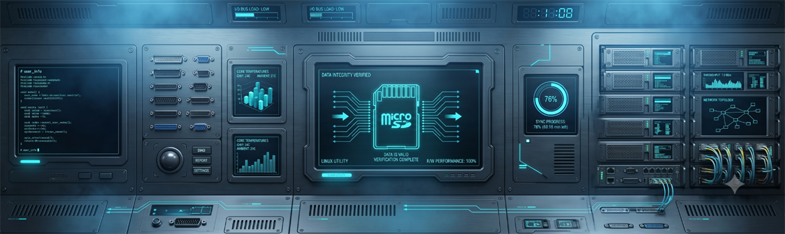

### X-Capacity & Speed Validator for sd cards v1.0



Ein professionelles, grafisches Werkzeug fuer Linux, um die tatsaechliche Kapazitaet und Geschwindigkeit von Speichergeraeten zuverlaessig zu ueberpruefen. Das Tool entlarvt gefaelschte Controller-Angaben (Fake Capacity) manipulationssicher und liefert exakte Hardware-Messergebnisse fuer eventuelle Haendlerdispute.

---

## 📸 Screenshots & Impressionen

Hier finden Sie eine Uebersicht der einzelnen Schritte des Wizards:

| 1. Hauptmenue (Wizard Start) | 2. Sicherheitsabfrage (Datenloeschung) |
|:---:|:---:|
|  |  |

| 3. Kapazitaetstest (Schreibvorgang) | 4. Echtheitspruefung (Lesevorgang) |
|:---:|:---:|
|  |  |

| 5. Mini-Speed-Test (dd Cache-Bypass) | 6. Finale Test-Zusammenfassung |
|:---:|:---:|
|  |  |

---

## ✨ Funktionen

* **Zweistufige Validierung:** Vollstaendiges Beschreiben des Laufwerks mit anschliessender Verifizierung via `f3`-Engine, um Mogel-Speicher (Fake Capacity) gnadenlos zu entlarven.
* **Intelligenter Live-Fortschritt:** Echtzeit-Anzeige von Schreib-/Lesegeschwindigkeit, geschriebenen Datenmengen und geschaetzter Restlaufzeit (ETA) direkt im grafischen Fenster.
* **Hardware-Erkennung:** Automatisches Auslesen des echten Controller-Herstellers und Modellnamens via `lsblk` fuer eine wasserdichte AliExpress-Beweisfuehrung.
* **Exakte Speicheranalyse:** Gegenueberstellung der theoretischen (vom Haendler manipulierten) Grösse und der real ermittelten physischen Speikerkapazitaet.
* **Praeziser Speed-Test:** Integrierter Mini-Laufwerkstest (500 MB), der den Linux-Arbeitsspeicher-Cache (`RAM-Cache`) durch `fdatasync` und `iflag=direct` komplett umgeht, um echte Hardware-Limits zu messen.
* **Volle Zweisprachigkeit:** Nahtlose Unterstuetzung fuer Deutsch und Englisch ueber einfache Start-Parameter.

---

## 🚀 Installation & Nutzung

Das Projekt laesst sich mit einem einzigen Befehl direkt ueber das Terminal einrichten. Es wird ein vollwertiger Starter im Zorin-Startmenue hinterlegt.

### Standard-Installation (Deutsch)
```bash <(curl -sL (https://raw.githubusercontent.com/albertuszerk/sdcardcheck/main/install.sh))```

### Installation mit Sprachparameter (Englisch)
```bash <(curl -sL (https://raw.githubusercontent.com/albertuszerk/sdcardcheck/main/install.sh)) en```

---

## 🛑 Deinstallation

Falls Sie die App und alle erstellten Desktop-Verknuepfungen wieder restlos vom System entfernen moechten, stehen Ihnen zwei Wege offen:

### Methode 1: Ueber die grafische Oberflaeche
Oeffnen Sie die App ueber das Startmenue und waehlen Sie die Option **"UNINSTALL"** (bzw. *"App komplett vom System entfernen"*).

### Methode 2: Ueber das Terminal (Manueller Befehl)
Fuehren Sie folgenden Befehl aus, um eine vollstaendige Deinstallation durchzufuehren:

```bash <(curl -sL (https://raw.githubusercontent.com/albertuszerk/sdcardcheck/main/uninstall.sh))```

> **DIESER BEFEHL FUEHRT EINE VOLLSTAENDIGE DEINSTALLATION DURCH UND ENTFERNT ALLE VERKNUEPFUNGEN.**

---

## 🛠 Technische Details & Funktionsweise

1. **Sicherheits-Check:** Nach der Auswahl des Laufwerkspfads wird eine strikte Warnung ausgegeben. Bei Bestaetigung wird das Verzeichnis geleert, um Platz fuer die Testdaten zu schaffen.
2. **Der f3write-Schritt:** Das Laufwerk wird blockweise mit eindeutig identifizierbaren `1GB` grossen Testdateien (`.h2w`) beschrieben.
3. **Der f3read-Schritt (Der Fake-Check):** Die App liest jede geschriebene Datei sequentiell wieder ein. Wenn ein gefaelschter Controller Daten im Kreis spiegelt oder ins Leere schreibt, bricht das Skript ab, isoliert die Zeile `Data OK` aus dem Log und ermittelt die exakte reale physische Grösse.
4. **Cache-Bypass Speed-Test:** Gewoehnliche Schreibbefehle spiegeln oft nur die RAM-Geschwindigkeit wider. `sdcardcheck` erzwingt mittels `conv=fdatasync` und `iflag=direct` echte physische I/O-Lese- und Schreibvorgaenge direkt auf den Speicherzellen.
5. **Automatische Reinigung:** Nach dem Abschluss des Tests werden alle temporaeren Arbeitsdaten rueckstandslos geloescht.

---

## 👥 Entwickler & Maintainer

* **Author:** Albertus Zerk
* **Repository:** [https://github.com/albertuszerk/sdcardcheck](https://github.com/albertuszerk/sdcardcheck)

---
*Tags:*
`#h2testw` `#f3write` `#fakecapacity` `#fakedrive` `#sdcardcheck` `#dataintegrity` `#storagevalidation` `#crystaldiskmark` `#benchmark` `#storageperformance` `#diskbenchmark` `#speedtest` `#readwritespeed` `#hardwarebenchmark`
